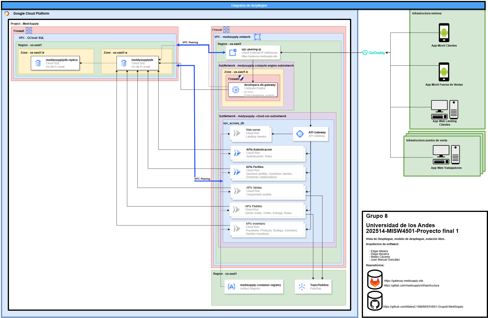

# MISW4501-Grupo8-Medisupply

Universidad de los Andes

202514 MISW4501 Proyecto final 1

## Arquitectos del software:

- Edgar Melara
- Diego Becerra
- Mateo Cáceres
- Juan Manuel González

## Vista de Despliegue; Modelo diagrama de despliegue, notacion libre.

## Repositorios:

- [**Privado** https://gitlab.com/medisupply/infraestructura](https://gitlab.com/medisupply/infraestructura)
- [https://github.com/MateoC1098/MISW4501-Grupo8-MediSupply](https://github.com/MateoC1098/MISW4501-Grupo8-MediSupply)

## Sitio

[https://gateway.medisupply.site](https://gateway.medisupply.site)
